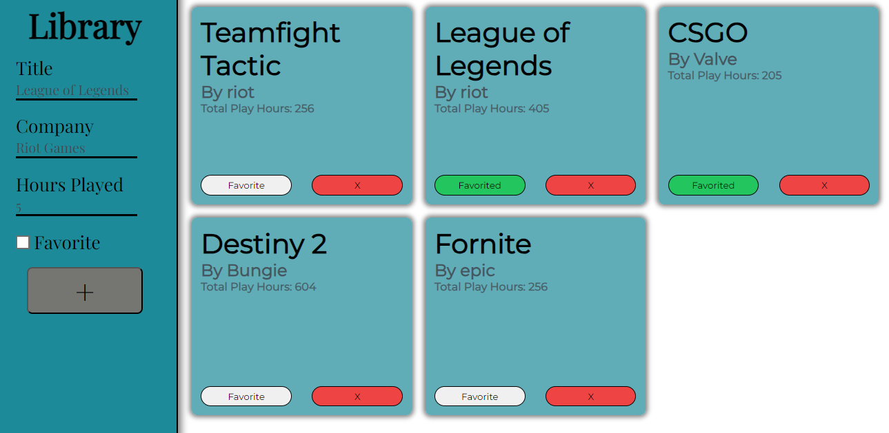

# Game-Library
A simple library for video games able to add to favorites and delete.

## Table of Contents
- [Access](#Access)
- [Installation](#installation)
- [Features](#features)
- [Tech Stack](#tech-stack)
- [License](#license)

## Access
Accessible from https://ama4538.github.io/Game-Library/

## Installation
1. Clone the repository: git clone https://github.com/Ama4538/Game-Library.git
2. Install dependencies: npm install
3. Run built in script: npm run build
4. Open on localHost: npm run preview

## Features
- Added Games into the library dynamically

### Tech Stack
- HTML
- CSS
- JavaScript

## License
Distributed under the MIT License. See `LICENSE` for more information.